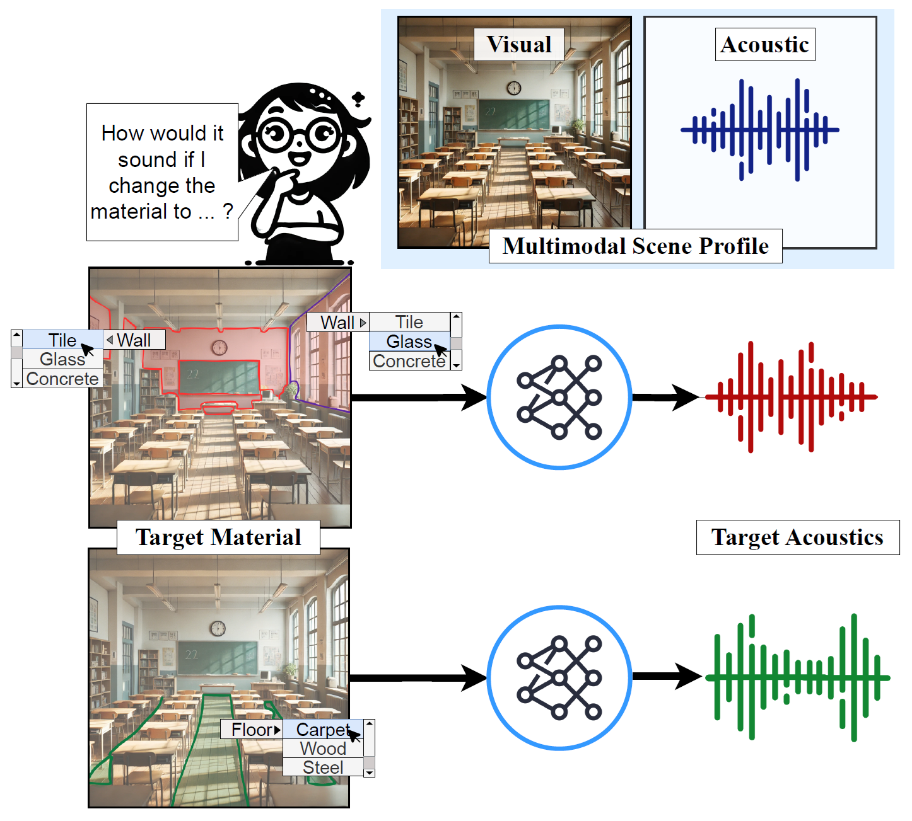

# How Would It Sound? Material-Controlled Multimodal Acoustic Profile Generation for Indoor Scenes

This repository contains the implementation and dataset for this paper, accepted in **ICCV 2025**

[How Would It Sound? Material-Controlled Multimodal Acoustic Profile Generation for Indoor Scenes](https://mahnoor-fatima-saad.github.io/m-capa.html)<br />
Mahnoor Fatima Saad, Ziad Al-Halah <br />
University of Utah

<p align="center">
  
</p>

Project Page: [https://mahnoor-fatima-saad.github.io/m-capa.html](https://mahnoor-fatima-saad.github.io/m-capa.html)

## Abstract

How would the sound in a studio change with a carpeted floor and acoustic tiles on the walls? We introduce the task of material-controlled acoustic profile generation, where, given an indoor scene with specific audio-visual characteristics, the goal is to generate a target acoustic profile based on a user-defined material configuration at inference time. We address this task with a novel encoder-decoder approach that encodes the scene’s key properties from an audio-visual observation and generates the target Room Impulse Response (RIR) conditioned on the material specifications provided by the user. Our model enables the generation of diverse RIRs based on various material configurations defined dynamically at inference time. To support this task, we create a new benchmark, the Acoustic Wonderland Dataset, designed for developing and evaluating material-aware RIR prediction methods under diverse and challenging settings. Our results demonstrate that the proposed model effectively encodes material information and generates high-fidelity RIRs, outperforming several baselines and state-of-the-art methods. Code and dataset will be released soon


## Installation and Dependencies

This code and environment was created and tested with ```python 3.9.19``` and ```pytorch 2.3.1``` with ```cuda 12.1```

To create the environment and install all dependencies run: 
```
conda env create -f environment.yml
conda activate MASynth
```

## Dataset
Download the Acoustic Wonderland Dataset using [this link](https://tinyurl.com/353mc7yy). The downloaded file should be a single .tar file of size 115GB. Untar this file. Within this directory there will be 84 individual tar files that will also need to be untared. Each directory corresponds to a scene in the Acoustic Wonderland Dataset and should have: 
1. ***RGB***: 200 .png files with the following naming convention: {scene_name}_rgb_{location_idx}.png
2. ***Category***: 200 .npz segmentation maps corresponding to [MP3D](https://github.com/niessner/Matterport) semantic segmentation with the following naming convention: {scene_name}_category_{location_idx}.npz
3. ***Material Config***: This is folder containing 2,673 subfolder, each represending a material configuration from the Acoustic Wonderland dataset. Each folder contains: 
    1. ***Material***: .npz material segmentation map where each index corresponds to a material from the Acoustic Wonderland Dataset (more details about ids, names and acoustic coeffiecients can be found in /material_configs). Each file follows:  {scene_name}_{material_config}_material_{location_idx}.npz
    2. ***Waveform***: .wav audio file with 0.5s at 16kHz sampling rate and corresponds to a matching material file. Each file follows: {scene_name}_{material_config}_ir_{location_idx}.wav

Store this dataset at any location and point to this location during training/testing

## Code


###### Training
###### Testing


